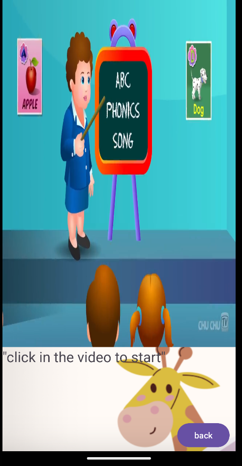
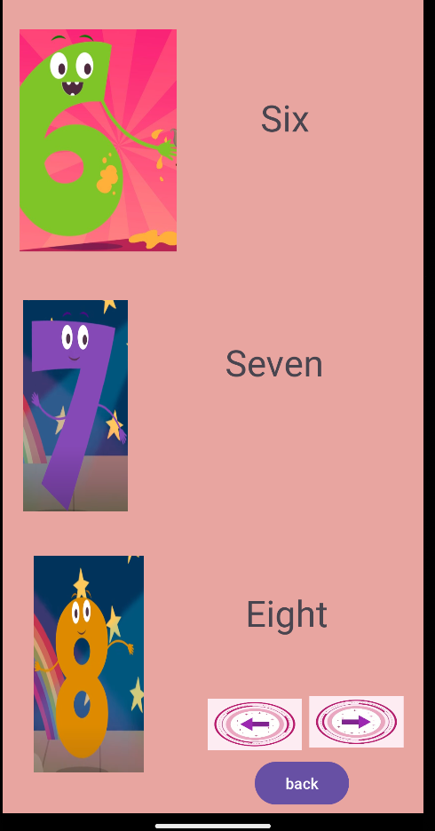

# Kidszoo App

Kidszoo App is a learning app designed for children. It provides interactive activities to help kids learn numeric and alphabetic words, shapes, and reading. Additionally, parents can analyze their kids' performance to track improvements over time.

## Features

- Interactive activities for learning numeric and alphabetic words
- Shape recognition and learning activities
- Reading exercises tailored for kids
- Parental analysis tool to track kids' performance and improvements

## Project Specifications

### 1. Innovative Idea
Kidszoo App is designed to be an innovative and engaging learning platform for children. By combining various interactive activities with parental analysis tools, it offers a comprehensive learning experience that adapts to each child's needs and progress.
This app is for children who will join the school or have recently started going to school.a preschool app for children of ages 2 to 5 years.

## Seven Activities
Kidszoo App consists of seven main activities:

1. **Main Activity**: The starting point of the app with a start button to proceed.

2. **Sign In Activity**: Allows users to sign in to their account.

3. **Home Screen Activity**: Provides access to different learning modules and parental analysis.

4. **Learning Modules Activity**: Interactive activities for learning numeric and alphabetic words, animals, and reading.

5. **Number Learning Activity**: Learning module focused on numeric words and concepts.

6. **Animals Learning Activity**: Learning module focused on animal names and characteristics.

7. **Alphabets Learning Activity**: Learning module focused on alphabetic words and letters.

8. **Test Activity**: Provides quizzes and tests for evaluating the child's knowledge and progress.

These activities offer a comprehensive learning experience for children, covering a range of subjects and topics while also providing tools for parental analysis and tracking of child performance.

### 3. Rich Collection of UI Views
Kidszoo App offers a rich collection of UI views to enhance the user experience, including:
- Customized buttons and navigation elements
- Colorful graphics and illustrations
- Interactive elements such as animated characters 

### 4. ListView with Click Events
The Learning Modules activity includes a ListView with click events, allowing children to select specific learning topics or exercises. Each item in the ListView corresponds to a different interactive activity or lesson.

### 5. Shared Preferences and Centralized Styles
Kidszoo App utilizes SharedPreferences to store user preferences and data, ensuring a personalized experience for each child. Additionally, centralized styles are applied throughout the app to maintain consistency and enhance visual appeal.

### 6. Implementation of Lifecycle Methods
Lifecycle methods are implemented where applicable to ensure proper management of app resources and user interactions. This includes handling activity lifecycle events such as onCreate(), onResume(), onPause(), and onDestroy().

